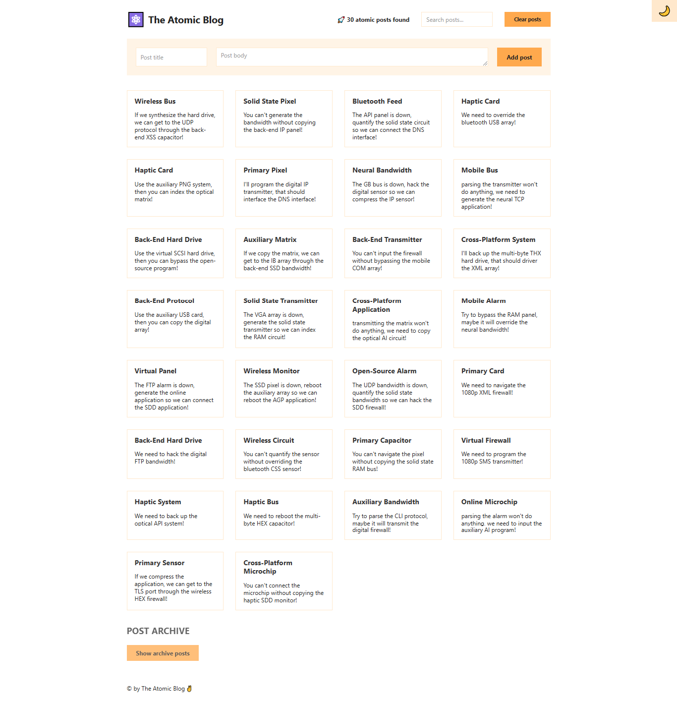

## The Atomic Blog 🚀

The Atomic Blog is a React-based project designed to showcase modern blog functionality with features like adding posts, searching through posts, and managing an archive of content. This project demonstrates the use of **React Context API** for state management, dynamic UI updates, and an intuitive dark mode toggle.

---

## 📸 Screenshot



---

## 🔗 Links

- Github Repo: [Github-link](https://github.com/Mikiyas6/The-Atomic-Blog/)
- Live Site URL: [Page-link](https://mikiyas6.github.io/The-Atomic-Blog/)

---

### 💡 Core Features
- **Add New Posts**: Easily add new blog posts using the form provided.
- **Search Posts**: Filter through posts dynamically using the search input.
- **Clear Posts**: Remove all posts with a single button click.
- **Post Archive**: Explore a large archive of randomly generated posts and add them as new blog entries.
- **Dark Mode Toggle**: Switch between light and dark modes with a simple button click.

### 🎯 Technology Highlights
- **React Context API**: Efficient state management across components.
- **Custom Hooks**: Simplify and centralize logic using a `usePosts` custom hook.
- **Dynamic State Management**: Handle search queries, post additions, and archive display dynamically.
- **CSS Styling**: Includes styling for light/dark mode and overall UI aesthetics.

---

## 🛠️ Getting Started

### 📦 Prerequisites
Make sure you have the following installed:
- [Node.js](https://nodejs.org/)
- npm or yarn (Node package managers)

### 🚀 Installation
1. Clone this repository:
   ```bash
   git clone <repository_url>
   ```
2. Navigate to the project directory:
   ```bash
   cd atomic-blog
   ```
3. Install dependencies:
   ```bash
   npm install
   ```

### 🏃 Run the App
Start the development server:
```bash
npm start
```
The application will be available at [http://localhost:3000](http://localhost:3000).

---

## 🖼️ Project Structure

### Key Files
- **`App.js`**: Main application component managing the layout and state for dark mode.
- **`PostContext.js`**: Contains the `PostProvider` and `usePosts` custom hook for context-based state management.

### Components Overview
1. **`Header`**: Displays the app's title, search bar, and controls for clearing posts.
2. **`Main`**: Contains the form to add new posts and the list of posts.
3. **`Archive`**: Displays a large archive of random posts that can be added to the main blog.
4. **`Footer`**: A simple footer with a copyright message.

---

## 📋 Features in Detail

### Context Management
- `PostContext` provides centralized state for:
  - List of blog posts.
  - Search functionality.
  - Add and clear post actions.

### Search Functionality
- Users can filter posts in real-time by typing in the search bar.
- Matches are case-insensitive and look for keywords in both the title and body.

### Post Archive
- Includes a preloaded archive of 10,000 random posts (adjustable for performance testing).
- Posts from the archive can be added as new blog entries.

### Dark Mode
- Utilizes `document.documentElement.classList.toggle` to apply a `fake-dark-mode` CSS class.
- Toggle available through the `ModeButton` component.

---

## 📁 Folder Structure

```
atomic-blog/
├── src/
│   ├── App.js          # Main application file
│   ├── PostContext.js  # Context provider and custom hook
│   └── index.css       # Styling for the app
├── package.json        # Project metadata and dependencies
└── README.md           # Documentation
```

---

## 🧪 Learning Goals
This project is designed to:
- Demonstrate effective use of React Context API for global state management.
- Show practical implementation of derived state and dynamic updates.
- Explore performance optimization techniques (e.g., generating archive posts once).

